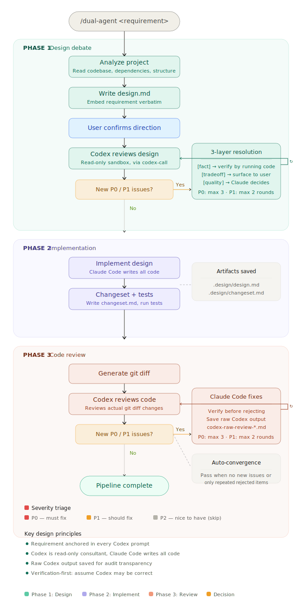

# codex-claude-pipeline

[中文版](./README.zh-CN.md)

Claude Code + Codex dual-agent collaboration via slash command. Claude Code acts as orchestrator and sole coder; Codex serves as read-only consultant for design review and code review.

## What It Does

```
You (in Claude Code): /dual-agent add a favorites feature

Phase 1 — Design Debate (adaptive rounds)
  Claude Code writes design doc  →  user confirms direction  →  Codex reviews  →  iterate

Phase 2 — Implementation
  Claude Code implements the approved design, runs tests

Phase 3 — Code Review (adaptive rounds)
  Codex reviews git diff  →  Claude Code fixes  →  iterate
```

No external orchestrator needed. Claude Code drives the entire flow from inside its own session using a slash command template.



## Install

```bash
git clone https://github.com/liyuhao957/codex-claude-pipeline.git
cd codex-claude-pipeline
./install.sh
```

This installs the following files into your home directory:
- `~/.claude/bin/codex-call` — shell wrapper that invokes Codex in read-only sandbox
- `~/.claude/commands/dual-agent.md` — full 3-phase slash command template
- `~/.claude/commands/dual-design.md` — design debate only
- `~/.claude/commands/dual-review.md` — code review only
- `~/.claude/prompts/dual-agent/architect.md` — design reviewer role prompt
- `~/.claude/prompts/dual-agent/reviewer.md` — code reviewer role prompt

## Usage

Inside any Claude Code session (must be in a git repo):

```
/dual-agent your requirement here
/dual-design your requirement here   # design debate only, no implementation
/dual-review [commit range]          # code review only
```

Claude Code will follow the template automatically: analyze the project, write a design, call Codex for review, implement, and get a code review from Codex.

## Key Features

- **Requirement anchoring**: The user's original requirement is embedded verbatim in every Codex prompt via a `<REQUIREMENT>` tag — prevents requirement drift across rounds.
- **Three-layer dispute resolution**: Issues are classified by type — `[fact]` (must verify by running code or checking docs), `[tradeoff]` (translate into user-understandable pros/cons), `[quality]` (Claude decides with rationale).
- **Verification-first mindset**: When processing Codex feedback, Claude Code defaults to assuming Codex might be correct and verifies before rejecting. "I don't think so" is not a valid rejection reason.
- **User checkpoints**: After writing the design doc, Claude Code pauses for user confirmation before sending to Codex. Requirement-scope changes are surfaced to the user as `deferred` items.
- **Raw output transparency**: Codex's raw output is saved to `.design/codex-raw-*.md` files — users can audit exactly what Codex said vs. how Claude Code interpreted it.
- **Adaptive rounds**: No P0/P1 → pass in 1 round. Has P0 → up to 3 rounds. Only P1 → up to 2 rounds. All remaining issues are tradeoffs already deferred → pass immediately.
- **Auto-convergence**: Reviews pass automatically when Codex reports no new P0/P1, or only repeats previously rejected issues without new technical arguments.
- **Severity triage**: P0 (must fix), P1 (should fix), P2 (nice to have, can skip). Only P0/P1 drive iteration.

## Artifacts

All intermediate work products are saved to `.design/` in your project:

```
.design/
├── design.md                 # Design document (Phase 1 output)
├── design-debate.md          # Design debate log (Phase 1)
├── changeset.md              # Implementation summary (Phase 2 output)
├── diff.txt                  # git diff snapshot (Phase 3 input)
├── implementation-debate.md  # Code review debate log (Phase 3)
├── codex-raw-design-*.md     # Raw Codex output from design reviews
├── codex-raw-review-*.md     # Raw Codex output from code reviews
└── .codex-session            # Codex session ID for context reuse
```

| File | Description |
|------|-------------|
| `design.md` | The design document written by Claude Code, revised through Codex review rounds. Includes the original requirement verbatim. |
| `design-debate.md` | Full debate record with columns: ID, type (`fact`/`tradeoff`/`quality`), severity, issue, status (`fixed`/`rejected`/`deferred`/`skipped`), and resolution details. |
| `changeset.md` | Summary written after implementation: which files were changed, what was done in each, risk points, and items needing manual confirmation. |
| `diff.txt` | Raw `git diff` output, exported as a file for Codex to review during the code review phase. |
| `implementation-debate.md` | Same format as `design-debate.md`, but for the code review phase. |
| `codex-raw-*.md` | Codex's unprocessed output for each round — lets users verify Claude Code's interpretation. |

## How It Works

The slash command template (`dual-agent.md`) instructs Claude Code to follow a strict 3-phase protocol:

1. **Design debate** — Claude Code writes `.design/design.md`, gets user confirmation on direction, then calls Codex via `codex-call` to review it. Issues are classified as `[fact]`, `[tradeoff]`, or `[quality]` and resolved through the three-layer mechanism. Adaptive rounds.
2. **Implementation** — Claude Code implements the approved design and writes `.design/changeset.md`.
3. **Code review** — Claude Code generates a diff and calls Codex to review the actual code changes. Same classification and resolution rules apply. Adaptive rounds.

`codex-call` is a Bash wrapper that resolves the Codex binary, enforces a timeout (default 600s, configurable via `CODEX_TIMEOUT`), supports session reuse (`--session-file` / `--resume`), and saves raw output (`--save-output`). Context files are passed via `--file` flags — the wrapper injects file paths into the prompt header so Codex reads them directly in its read-only sandbox, rather than having Claude Code inline file contents into the prompt. Always runs Codex with `--sandbox read-only`.

## Requirements

- macOS
- Git repository (the slash command checks for this)
- `codex` CLI in PATH (or Codex.app installed)
- `claude` CLI (Claude Code)
- Optional: `timeout` or `gtimeout` (from coreutils) for Codex call timeouts

## License

MIT
